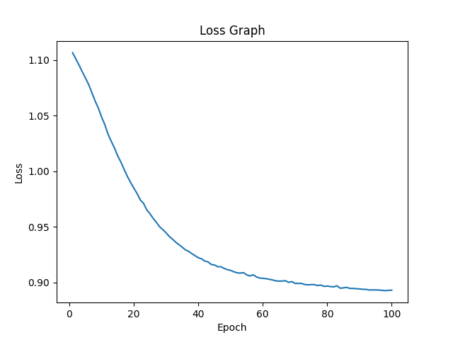

# HELP

## 学習の際に損失が十分に下がらない

**学習の際に損失が十分に下がらない場合、いくつかの原因が考えられる。
以下にいくつかの可能性とそれに対する対処法を挙げる。**

1. **学習率（Learning Rate）が大きすぎる**:
   高い学習率を設定すると、学習が不安定になり、損失が収束せずに大きな値を取ることがある。
対処法として学習率を下げてみる。適切な学習率を探るために、小さな値から始めて徐々に増やしていく方法もある。

~~~python
# Hyperparameters
max_epoch = 300
batch_size = 30
hidden_size = 10
lr = 0.01  # 例えば、0.01など適切な学習率に調整
~~~

2. **最適化手法の選択**:
   使用している最適化手法によっても学習の収束性が異なる。SGDやMomentum、Adamなど異なる最適化手法を試してみる必要がある

~~~python
from dezero.optimizers import Adam  # 必要に応じて適切な最適化手法をインポート

# モデルと最適化手法の設定
model = MLP((hidden_size, 3))
optimizer = MomentumSGD(lr).setup(model)  # MomentumSGDやAdamなど適切な最適化手法に変更
~~~
3. **ネットワークのアーキテクチャ**:
   ネットワークのアーキテクチャによっても収束性が変わることがある。層の数やニューロンの数を調整してみることで、学習が改善する可能性がある。

4. **正規化**:
   正規化（バッチ正規化、ドロップアウトなど）を使用することで、学習が安定しやすくなることがある。過学習を抑制し、学習が収束しやすくなる可能性がある。

5. **データの前処理**:
   データが適切に前処理されているか確認する。データの正規化やスケーリングを行うことで学習が安定しやすくなることがある。

6. **初期化**:
   ネットワークの重みやバイアスの初期化方法も学習に影響を与える。適切な初期化方法を選ぶことで、学習の収束性が向上する可能性がある。

7. **過学習**:
   過学習が起きている場合、損失が十分に下がらないことがある。モデルが訓練データに過剰に適合している可能性があるため、データ拡張や正則化を検討する

