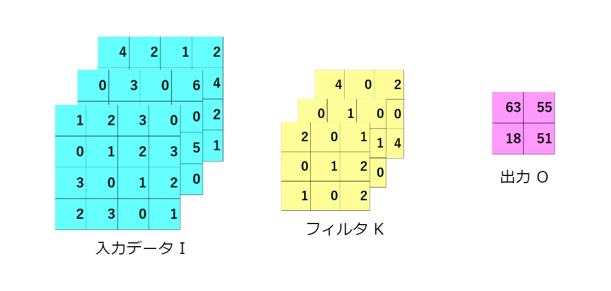

# CNN (Convolutional Neural Networks) のメカニズム

CNNは、画像や音声などのグリッド構造データの自動特徴抽出を得意とするニューラルネットワークの一種である。
CNNは畳み込みという基本的な画像処理の演算を実行する**畳み込み層**と呼ばれる層を持つことが特徴である

---

# 1. Convolutionレイヤ (畳み込みレイヤ)

畳み込みレイヤはCNNの核心となる部分で、ローカルな情報をキャッチする役割がある。これは、入力データに対してフィルタ (またはカーネル) をスライドさせて畳み込みを行うことで実現される。

## 数式

畳み込み操作は以下の画像とフィルタ間で定義される積和演算の式で表される。

$$
O_{i,j} = \sum_{m}^{W_f -1} \sum_{n}^{H_f -1} I_{i-m, j-n} \times K_{m, n}
$$
フィルタを上下・左右反転させると次の式となる。
$$
O_{i,j} = \sum_{m}^{W_f -1} \sum_{n}^{H_f -1} I_{i+m, j+n} \times K_{m, n}
$$
ここで、$O_{i,j}$ は出力のピクセル、$I_{i+m, j+n}$ は入力のピクセル、

フィルタの画素のインデックスを$(m,n)(m = 0, 1 , \dots , W_f -1 , n = 0, 1, \dots , H_f -1)$で表し
$K_{m, n}$ はフィルタの画素値を表す。

## 例:

また、全結合ニューラルネットワークでは、重みパラメータの他に**バイアス**も存在する。

$$
O_{i,j} = \sum_{m} \sum_{n} I_{i+m, j+n} \times K_{m, n} + B
$$

フィルタの動き:

## 1.2. **パディング (Padding)**

畳み込み操作を行う際に、入力データの周辺に仮のデータ (通常0) を追加すること。これにより、出力データのサイズの縮小を防ぐか、または調整することができる。

本来の入力データと同じ大きさの出力が得られる

## 1.3.**ストライド (Stride)**

フィルタをスライドさせる際のステップのサイズ。ストライドが1の場合、フィルタは入力データ上で1ピクセルずつスライドする。ストライドが2の場合は2ピクセルずつとなる。

ストライドを大きくすると出力サイズは小さくなる。また、パディングを大きくすると出力サイズは大きくなる。

## 1.4.出力サイズの計算

出力サイズ : $O$ ,
入力サイズ : $I$ ,
フィルタ(カーネル) : $K$ ,
ストライド : $S$ ,
パディング : $P$,

とすると、出力サイズは

$$
O = \frac{I + 2P - K}{S} + 1  
$$

で表すことができる

## 1.5. 3階テンソルとしての畳み込み

CNNでは一般的に3階テンソル（3D TENSOR）として画像データを扱う。これは、高さ、幅、そして深さ（チャンネル数）の3つの次元を持っている。例えば、カラー画像はRGBの3つのチャンネルから成るので、3階テンソルとして考えることができる。

畳み込みをブロックで考えると、フィルタは入力データの小さなブロックに適用され、それぞれのブロックの出力が新しい特徴マップのピクセルとなる。

I,K,O,B　をそれぞれ**ブロック**としたもの

---

# 2. Poolingレイヤ (プーリングレイヤ)

プーリングレイヤは、畳み込みによって抽出された特徴のサイズを縮小することで計算量を減らし、特徴の位置感度を低くする役割がある。主なプーリング操作にはMax PoolingやAverage Poolingがある。

## 2.1. **ダウンサンプリング (Downsampling)**

特徴マップの次元を削減する操作。Max Poolingなどのプーリング操作はダウンサンプリングの一形態として考えられる。

### 例: 

2x2 Max Poolingの場合、2x2の領域の中の最大値がその領域の出力となる。

---

# 3. 活性化関数(Activation function)

活性化関数は、ニューラルネットワークの各ニューロンの出力を決定するための関数である。これにより、ネットワークに非線形性を導入し、複雑な関数やパターンを学習する能力を持たせることができる。非線形性の導入がないと、深いニューラルネットワークの多くの層は、単一の層に集約することが可能となり、多層の意味がなくなる。主な活性化関数としては、Sigmoid、Tanh、ReLUなどが存在する。

## 3.1. ReLU (Rectified Linear Unit)

ReLUは、非線形性をネットワークに導入するためのもので、特に深いニューラルネットワークで広く使われている。負の入力値に対しては0を、正の入力値に対してはそのままの値を出力する。

### 数式:

ReLU関数は次のように表される。
$$
f(x) = \max(0, x)
$$

## 3.2. Sigmoid

Sigmoid関数は、任意の実数値を取り、0から1の間の値を出力する。これは、確率や二項分類の出力としてしばしば用いられる。

### 数式:

Sigmoid関数は次のように表される。
$$
f(x) = \frac{1}{1 + e^{-x}}
$$

## 3.3. Tanh

Tanh（ハイパボリックタンジェント）関数は、Sigmoid関数と似ているが、出力の範囲が-1から1の間である。

### 数式:

Tanh関数は次のように表される。
$$
f(x) = \tanh(x) = \frac{e^{x} - e^{-x}}{e^{x} + e^{-x}}
$$

それぞれの関数をグラフにすると以下のようになる

各活性化関数は、特定のタスクやネットワークの構造に応じて選択される。ReLUは学習の速度や収束性に優れているため、現代の深いネットワークでよく使われているが、ニューロンの"死"という問題も持っている。このような問題を解決するための変種として、Leaky ReLUやParametric ReLUなども提案されている。

---

# 4. 正規化 (Normalization)

正規化は、ニューラルネットワークの学習を助けるために入力データや層の出力を特定の範囲または分布に変換する手法である。特に、深いニューラルネットワークでは、正規化が無ければ学習が不安定になったり、収束が遅くなることが知られている。

$N$個のサンプルから構成されるミニバッチと、出力サイズが $W\times H \times C$ の畳み込み層を考えるとき、各データポイントに対してインデックスはバッチ、チャンネル、画像サイズの順に割り当てられる。具体的に、それぞれの上限を $(N,C,WH)$ として示すことができる。

正規化手法は、これらのインデックスの組み合わせに基づき、特定の統計量を計算する領域を決定する。以下の表は、各正規化手法がどのようにインデックス $*$ を取り扱うかを示す。

|正規化手法|計算の範囲|
|:---------:|:------------:|
|バッチ正規化| $(*,C,*)$|
|レイヤー正規化| $(N,*,*)$|
|インスタンス正規化|$(N,C,*)$ |

- **バッチ正規化**: チャンネルごとに統計量を計算するが、ミニバッチ全体での平均と分散を使用する。
- **レイヤー正規化**: 各サンプルごとに、全てのチャンネルと空間的な位置で統計量を計算する。
- **インスタンス正規化**: 各サンプルとチャンネルごとに、空間的な位置で統計量を計算する。

これらの正規化手法は、異なる範囲のデータに基づいて統計量を計算することで、モデルの学習を安定化させ、性能を向上させる効果が期待される。

## 4.1. バッチ正規化 (Batch Normalization)

バッチ正規化(Batch Normalization)は、ミニバッチごとの入力分布を正規化することで、学習を安定化させ、高速化する手法である。
具体的には、各ミニバッチの平均と分散を用いて正規化を行い、さらにスケール変換と平行移動を可能にする学習可能なパラメータを持つ。

ミニバッチのサンプルを $n=(1,2\dots N)$で表し、畳み込み層のチャンネルCを構成する 
$W \times H$ 内の位置 $(i,j)$のユニットへの層入力を 
${u}_{ijc}^{(n)}$とする時、平均は以下のように表せる。

$$
\mu_C = \frac{1}{NWH} \sum_{i,j,n} {u}_{ijc}^{(n)}
$$

ミニバッチの分散は次のように計算される:

$$
\sigma_C^2 = \frac{1}{NWH} \sum_{i,j,n} \left( {u}_{ijc}^{(n)} - \mu_C \right)^2
$$

次のように正規化する
$$
\hat{u}_{ijc}^{(n)} = \gamma_C \frac{{u}_{ijc}^{(n)} - \mu_C}{\sqrt{\sigma_C^2 + \epsilon}} + \beta_C

$$

ここで、$\gamma$ と $\beta$ は学習可能なパラメータ(学習によって定めた定数)であり、

$\mu_C$ と $\sigma_C^2$ はミニバッチの平均と分散を示す。

$\epsilon$ は数値的な安定性を保つための微小な正の値である。
(0除算を防ぐ為の値)

## 4.2. 局所コントラスト正規化 (Local Contrast Normalization)

局所コントラスト正規化 (Local Contrast Normalization: LCN) は、特定の位置に焦点を当て、その位置の入力のコントラストを強調または正規化する手法である。この方法は、特に画像データなどの空間的なデータで、近隣のピクセルとの関係を強調するのに有効である。

### 数式の説明

$\mu_{ij}$  と $\sigma_{ij}^2$ は位置 $(i, j)$ の周囲のピクセルの平均と分散を示す

畳み込み層の出力の各要素を、その近傍の要素の平均や標準偏差を用いて正規化する操作を考えると、数学的には、ある位置 $(i, j)$ のピクセル値 $u_{ij}$ を次のように正規化する

$$
\hat{u}_{ij} = \frac{u_{ij} - \mu_{ij}}{\sqrt{\sigma_{ij}^2 + \epsilon}}
$$

ここで、 $\epsilon$ は数値的な安定性を保つための微小な正の値である。

局所コントラスト正規化は、バッチ正規化とは異なり、各位置での値を、その周辺の情報を基に独立して正規化する。この特性により、画像内の局所的な特徴やパターンを強調する効果が期待される。

---

# 5. 全結合層 (Fully Connected Layer)

全結合層（Fully Connected Layer、略称: FC layer）は、ニューラルネットワークの一部として広く利用される層の1つである。この層は、各入力ノードが他のすべての出力ノードと結合している特性から、その名がつけられた。特に、畳み込みニューラルネットワーク (CNN) の末端で、特徴マップを1Dのベクトルに変換して、最終的な分類や予測を行うために用いられる。

## 5.1. 目的

全結合層の主な目的は、前の層からの特徴を組み合わせて、タスク（分類、回帰など）に対する最終的な予測を行うことである。例えば、画像分類問題において、CNNの畳み込みレイヤやプーリングレイヤを通過した後、得られた特徴マップを全結合層に入力として、最終的な分類ラベルの確率ベクトルを出力する。

## 5.2. 数学的背景

全結合層の基本的な計算は、線形変換と活性化関数の適用から成る。

数学的には以下のように表される:

$$y = f(W \bm{x} + \bm{b})$$

ここで、
- $\bm{x}$ は入力ベクトル
- $W$ は重み行列
- $\bm{b}$ はバイアスベクトル
- $f$ は活性化関数 (例: ReLU、Sigmoid、Tanh等)

## 5.3. 用途

1. **分類タスク**: 全結合層は、特徴ベクトルを受け取り、それを特定のクラスラベルの確率分布に変換するために使われる。これは、ソフトマックス関数をアクティベーションとして使用することで実現されることが多い。

2. **回帰タスク**: 全結合層は、特徴ベクトルを受け取り、連続的な値またはベクトルを出力するために使われる。この場合、アクティベーション関数として線形関数や他の関数が使用されることがある。

---

# 6. 損失関数 (Loss Function)

損失関数（Loss Function）は、機械学習や深層学習のモデル訓練中の性能を評価するための関数である。この関数は、モデルの予測と実際の目標値の間の差異を数値として表現し、その差異を最小化することを目指してモデルのパラメータを更新する際の基準として使用される。

## 6.1. 数学的定義

一般的な損失関数 $L$ は、実際のラベル $y$ とモデルによる予測 $\hat{y}$ の関数として定義される:

$$L(y, \hat{y})$$

この関数の値が小さいほど、モデルの予測が正確であると評価される。

参考 : [損失関数](loss-function.md)

## 重要性

損失関数は、モデルの訓練中のガイドとなる。最適化手法（例：勾配降下法）は、この関数を最小化する方向にモデルのパラメータを更新する。したがって、適切な損失関数の選択は、モデルの性能と収束速度に大きく影響する。

---

# 7. 最適化手法 (Optimization Techniques)

CNNの学習は、一般的なニューラルネットワークの学習と同様に、バックプロパゲーションを使用して行われる。バックプロパゲーションは、予測誤差を最小化するためのパラメータの調整を行うアルゴリズムであり、損失関数の勾配を計算して、その勾配情報を用いてパラメータを更新する。

最適化手法には、SGD (Stochastic Gradient Descent) やその派生であるMomentum, AdaGrad, RMSprop, Adamなどがある。

参考：[Optimizer](optimizer.md)

---

参考:

>一文看懂variant convolutions
> <https://blog.csdn.net/WANGWUSHAN/article/details/103575060>

>深層学習 改訂第2版　岡谷貴之

>962 - 連載解説 「Deep Learning (深層学習)」 〔第4回〕<https://www.jstage.jst.go.jp/article/jjsai/28/6/28_962/_pdf>
