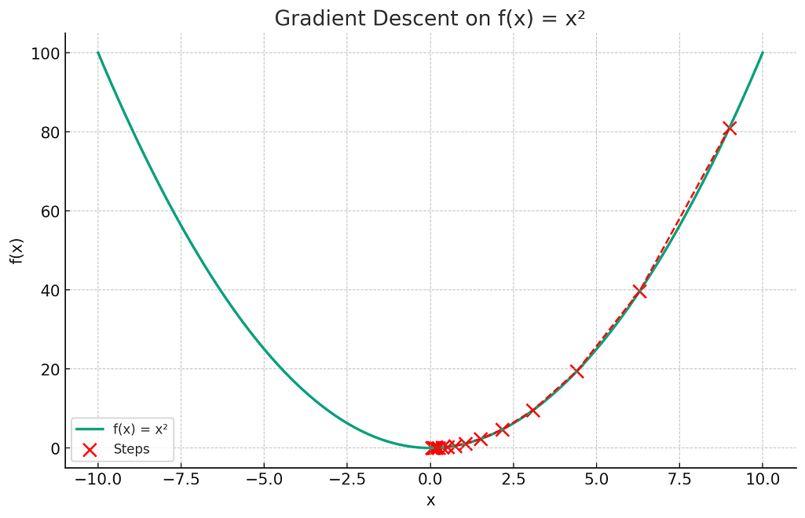

# SGD (Stochastic Gradient Descent)

## 1. 勾配降下法の基礎

**勾配降下法 (Gradient Descent)** は、**損失関数(Loss Function)** の最小値を見つけるために使用される最適化アルゴリズムの一つ。このアルゴリズムは、関数の現在の地点における勾配、つまり最も急な下降方向へとわずかに動くことで、関数の値を徐々に減少させる。

訓練データセット
$$
D = \{(x_1 , d_1),(x_2, d_2), \dots, (x_n,d_n)\}
$$
において計算される損失関数 $E(w)$ をパラメータ $w$ について最小化することが目標となる。

以下のグラフは　$f(x) = x^2$の関数と、勾配降下法による最適化のステップを示しでいる。
視覚的には、赤い「X」マークが勾配降下法によって関数の最小値に近づいていく様子を示している。

> Gradient Descent in Machine Learning: Python Examples <https://vitalflux.com/gradient-descent-explained-simply-with-examples/>

## 2. 勾配とベクトル

勾配は、関数の最も急な上昇方向を指し示すベクトルとして定義される。多変数関数における勾配は、各変数に対する偏微分を要素とするベクトルとして定義され、損失 $E$ に対するパラメータ ${w}$ の勾配は以下のように定義される:

$$
\nabla E(w) = 
\frac{\partial E}{\partial w} =
\left[ \frac{\partial E}{\partial w_1}, \frac{\partial E}{\partial w_2}, \ldots \right]
$$

現在の重みを $w_{t}$ , 動かした後の重みを $w_{t+1}$ とするとSGDのパラメータの更新は次のようになる:

$$
w_{t+1} = w_{t} - \alpha \nabla E(w_{t}) 
$$

ここで $\alpha$ は $w$ の更新量の大きさを定める定数で、**学習率(Learning rate)** と呼ぶ。

## 3. 学習率の役割

**学習率 (Learning Rate)** は、勾配の方向にどれだけ進むかを決めるためのパラメータである。高い学習率は大きなステップを意味し、低い学習率は小さなステップを意味する。

### 3.1. 学習率の重要性

適切な学習率の選択は、最適化プロセスにおいて重要であり、学習率が大きすぎると最小値を通り過ぎてしまい、小さすぎると収束までに長い時間がかかる。

例えば、関数 $f(x) = x^2$ に対する勾配降下法を考える。この関数の勾配は $2x$ であり、初期値 $x_0 = 10$ と学習率 $\alpha = 0.1$ のもとでの更新は以下のようになる:

1. $t = 0$: $x_0 = 10$, $f(x_0) = 100$, $\nabla f(x_0) = 20$
2. $t = 1$: $x_1 = x_0 - \alpha \nabla f(x_0) = 10 - 0.1 \times 20 = 8$
3. $t = 2$: $x_2 = x_1 - \alpha \nabla f(x_1) = 8 - 0.1 \times 16 = 6.4$

と続けることで、$x$ は最小値である $0$ に近づいていく。

## 4. バッチ学習とSGD

**バッチ学習 (Batch Learning)** では、すべてのデータを使用して一度に重みを更新する。対照的に、**SGD (Stochastic Gradient Descent)** では、一度に1つのサンプルだけを使用して重みを更新する。SGDの利点は、多数のデータ点で重みを頻繁に更新することで、局所的な最小値から脱出しやすくなる点にある。

## 5. エポックとミニバッチ

**エポック (Epoch)** は、訓練データ全体がモデルを通過するたびにカウントされる。**ミニバッチ (Mini-batch)** は、一度に複数のサンプルを使用して重みを更新するSGDの変種である。ミニバッチ $D_t$ に対する重みの更新は次のようになる:

$$
w_{t+1} = w_t - \eta \nabla E(D_t)
$$

ミニバッチ $D$ に対する平均勾配は以下のように計算する:

$$
\nabla_D E(w) = \frac{1}{|D|} \sum_{i \in D} \frac{\partial E_i}{\partial w}
$$

## 6. モメンタムと加速勾配法

**モメンタム (Momentum)** は、過去の勾配の情報を利用して現在の重みの更新を行う方法であり、次のように計算される:

$$ 
v_{t+1} = \mu \cdot v_t + \eta \nabla E(w_t)
$$

$$ 
w_{t+1} = w_t - v_{t+1}
$$

ここで、$\mu$ はモメンタムの係数、$v_t$ は時刻 $t$ における速度である。

参考: [optimizer](optimizer.md)

## 7. 訓練誤差、汎化誤差、過学習、バイアス分散トレードオフ

訓練データ上での誤差を**訓練誤差 (Training Error)**、新しいデータ上での誤差を**汎化誤差 (Generalization Error)** と呼ぶ。**過学習 (Overfitting)** は、モデルが訓練データに特化しすぎて新しいデータに対応できなくなる現象である。

また、**バイアス分散トレードオフ (Bias-Variance Tradeoff)** は、モデルの簡潔さ（バイアス）とデータに対する柔軟性（分散）のバランスをとることで、汎化誤差を最小化する概念である。
