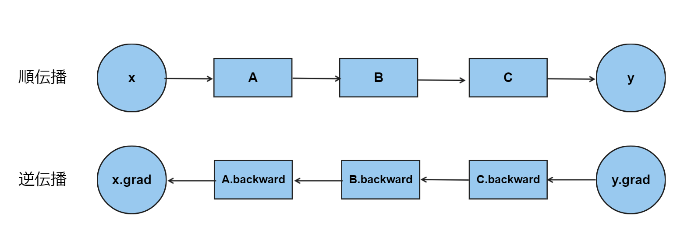
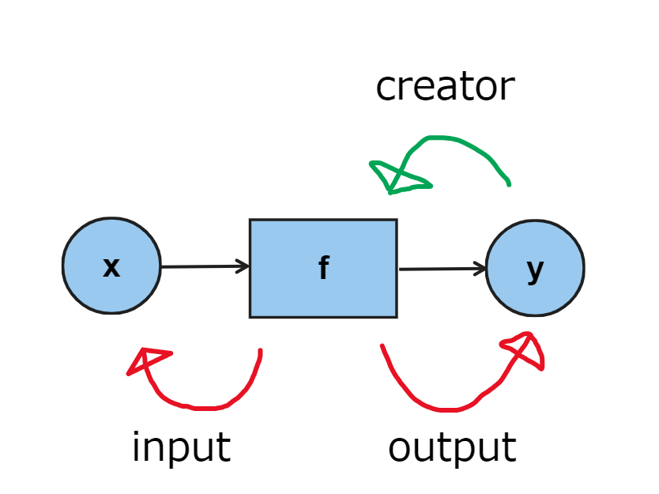
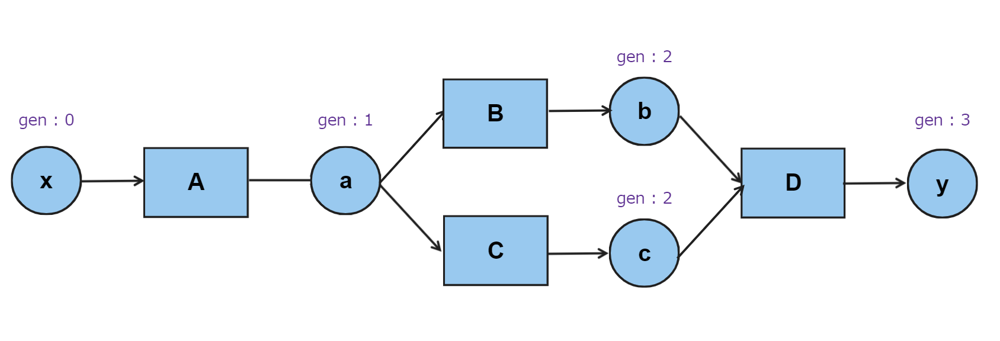

# STEP 1 ~ 10

## step 1

**可変変数 Classの実装**　

## step 2

var classに`計算メソッド`をついか

## step 6

逆伝播の実装

逆伝播は $ \frac{dy}{dy} = 1 $からスタートする。
そのため、出力yの微分を`1.0`に設定する.
そしてC,B,Aの順でbackwardメソッドを呼び出すことで各変数に対する微分が求まる

図1

## step 7

step6でバックプロパゲーションを動かした。
しかし、そこでは逆伝播の計算を手作業でコーディングする必要があった。
このstep7ではその逆伝播の自動化した
順伝播が行われるときにoutputの情報を関数fに追加する(creator)

Varクラスのインスタンス変数`creator`で一つ前の`Function`へ辿る
そして`Function`のインスタンス変数`input`で1つ前の`Var`へ辿る

**関数と変数のつながりを順伝播でデータを流す時に作られる**
このデータ構造を**リンク付きノード**と呼ぶ

図3

## step 8

while(loop)を使ったstep 7のプログラムの最適化

## step 9 

# step 11 ~ 20

## step 14
同じ変数を繰り返し扱う

## step 16

世代の追加

## step 17

## step 18

メモリ使用量を減らすために不要な微分を削除する。
深層学習において中間変数はあまり使わないので微分を消去する.

